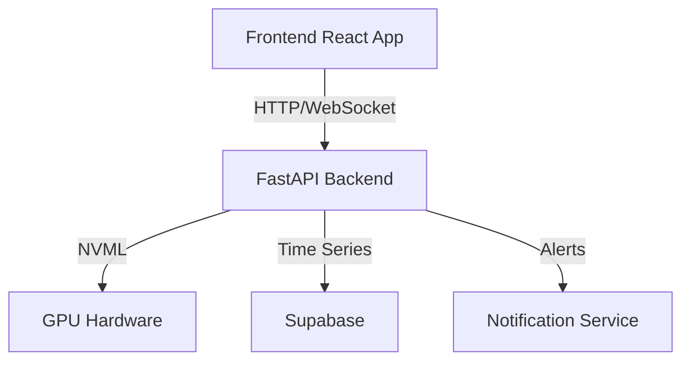

# GPU Sentinel Pro

> "Information should not be displayed all at once; let people gradually become familiar with it." - Edward Tufte

Transform GPU monitoring from complex metrics into intuitive visual patterns. Enterprise-grade NVIDIA GPU monitoring with real-time analytics, intelligent alerts, and historical analysis.

[](https://github.com/jackccrawford/gpu-sentinel-pro/actions/workflows/codeql.yml)
[](https://x.com/intent/follow?screen_name=jackccrawford)
[](https://choosealicense.com/licenses/mit/)
[](https://codeium.com)


*Real-time GPU metrics visualized for instant comprehension*

## Quick Start

### Prerequisites
- NVIDIA GPU with compute capability 3.0 or higher
- NVIDIA Driver 450.80.02 or higher
- Python 3.8+ and Node.js 16.0+
- 4GB RAM (8GB recommended)
- 1GB free disk space

### Installation

1. Clone the repository:
```bash
git clone git@github.com:jackccrawford/gpu-sentinel-pro.git
cd gpu-sentinel-pro
```

2. Set up the backend:
```bash
cd backend
python -m venv venv
source venv/bin/activate  # On Windows: .\venv\Scripts\activate
pip install -r requirements.txt
```

3. Set up the frontend:
```bash
cd frontend
npm install
```

4. Start the services:
```bash
# Terminal 1 - Backend
cd backend
python src/service/app.py

# Terminal 2 - Frontend
cd frontend
npm run dev
```

5. Access the dashboard at http://localhost:5173

## Pro Features

### 🎯 Enterprise-Grade Monitoring
- **Real-time Visual Dashboard**
  - Modern React components with Material UI
  - Responsive design for desktop and mobile
  - Dark/light mode with automatic system preference detection
  - Multi-GPU support with individual monitoring panels

- **Advanced Metrics**
  - Temperature and utilization with color-coded ranges
  - Memory usage and bandwidth monitoring
  - Power consumption and efficiency tracking
  - Process-level GPU utilization
  - Custom metric aggregation

### 🔔 Intelligent Alert System
- **Configurable Thresholds**
  ```json
  {
    "temperature": {
      "warning": 75,
      "critical": 85
    },
    "memory": {
      "warning": 85,
      "critical": 95
    }
  }
  ```
- **Alert Types**
  - Temperature spikes
  - Memory leaks
  - Process crashes
  - Power anomalies
  - Custom conditions

### 📊 Analytics & Reporting
- **Historical Data**
  - Time-series metrics storage
  - Customizable retention policies
  - Data export in multiple formats
  - Trend analysis and forecasting

- **Performance Insights**
  - Workload pattern recognition
  - Resource utilization heatmaps
  - Efficiency recommendations
  - Cost analysis tools

### 🛠 Enterprise Integration
- **API Access**
  - RESTful API with OpenAPI documentation
  - Secure authentication
  - Rate limiting and quotas
  - Webhook support

- **Security**
  - Role-based access control
  - Audit logging
  - SSL/TLS encryption
  - Regular security updates

## Configuration

### Backend Settings
```python
# config.py
SETTINGS = {
    'update_interval': 1000,  # ms
    'retention_period': '30d',
    'log_level': 'INFO',
    'enable_analytics': True,
    'alert_cooldown': 300,  # seconds
}
```

### Frontend Configuration
```typescript
// config.ts
export const CONFIG = {
  API_URL: 'http://localhost:8000',
  REFRESH_RATE: 1000,
  THEME_MODE: 'system',  // 'light' | 'dark' | 'system'
  CHART_HISTORY: 300,    // data points
};
```

## System Architecture



## Contributing

1. Fork the repository
2. Create a feature branch: `git checkout -b feature/amazing-feature`
3. Commit your changes: `git commit -m 'feat: add amazing feature'`
4. Push to the branch: `git push origin feature/amazing-feature`
5. Open a pull request

## Support

- 📚 [Documentation](docs/)
- 🐛 [Issue Tracker](https://github.com/jackccrawford/gpu-sentinel-pro/issues)
- 💬 [Discussions](https://github.com/jackccrawford/gpu-sentinel-pro/discussions)
- 📧 [Contact Support](mailto:support@gpusentinel.pro)

## License

This project is licensed under the MIT License - see the [LICENSE](LICENSE) file for details.

---
