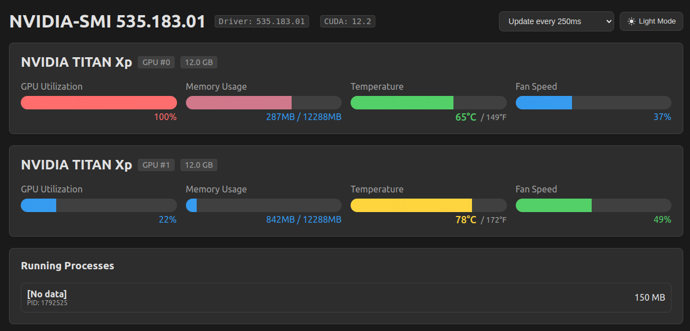
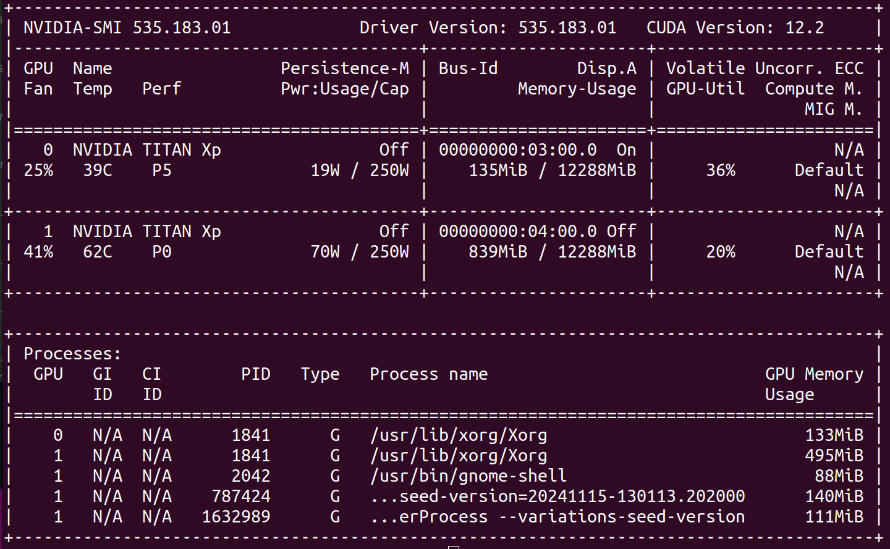
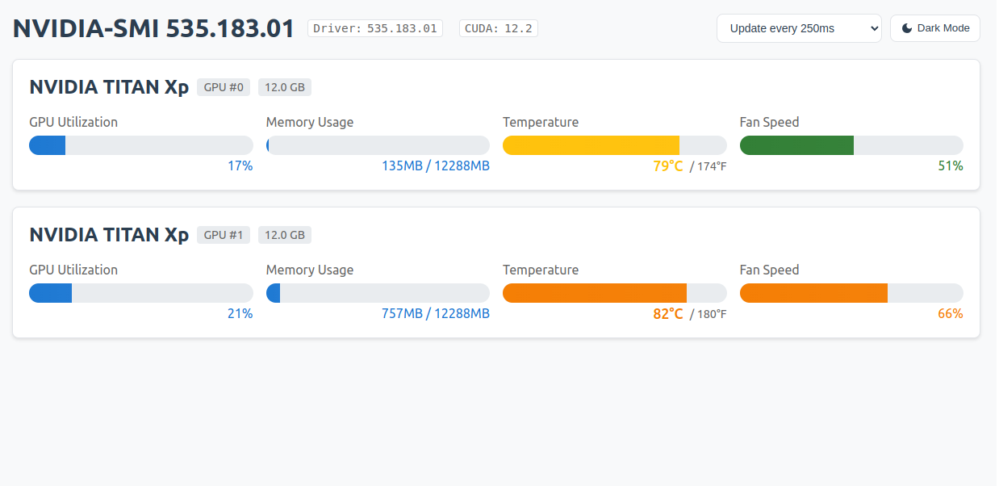
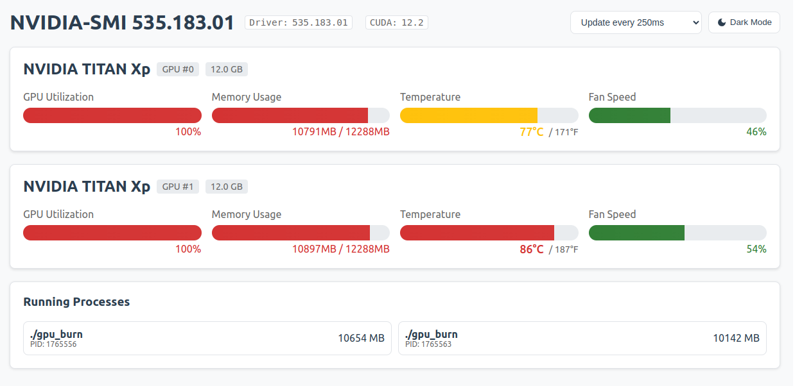

# GPU Sentinel Pro

> "Information should not be displayed all at once; let people gradually become familiar with it." - Edward Tufte

Transform GPU monitoring from complex metrics into intuitive visual patterns. Enterprise-grade NVIDIA GPU monitoring with real-time analytics, intelligent alerts, and historical analysis.

[](https://github.com/jackccrawford/gpu-sentinel-pro/actions/workflows/codeql.yml)
[](https://sonarcloud.io/summary/new_code?id=jackccrawford_gpu-sentinel-pro)
[](https://sonarcloud.io/summary/new_code?id=jackccrawford_gpu-sentinel-pro)
[](https://sonarcloud.io/summary/new_code?id=jackccrawford_gpu-sentinel-pro)
[](https://sonarcloud.io/summary/new_code?id=jackccrawford_gpu-sentinel-pro)


*Real-time GPU metrics visualized for instant comprehension*

## Project Overview
- [Requirements & User Stories](docs/requirements/REQUIREMENTS.md)
- [Technical Architecture](docs/architecture/ARCHITECTURE.md)
- [Development Guide](docs/requirements/DEVELOPMENT_GUIDE.md)
- [API Documentation](docs/API.md)

## Why GPU Sentinel Pro?

Do you find yourself:
- Parsing dense terminal output when you should be focusing on your work?
- Missing critical temperature spikes or memory leaks?
- Lacking historical data for performance analysis?
- Needing better alerting for GPU health?
- Managing multiple GPUs across different workloads?

## Features

### 🎯 Intuitive Monitoring
- Real-time visual dashboard
- Color-coded temperature ranges
- Resource utilization patterns
- Multi-GPU support
- Dark/light mode

### 🔔 Intelligent Alerts
- Configurable thresholds
- Temperature spike detection
- Resource bottleneck warnings
- Email/webhook notifications

### 📊 Advanced Analytics
- Historical performance data
- Time-series analysis
- Usage pattern recognition
- Power efficiency metrics

### 🛠 Enterprise Integration
- RESTful API
- Supabase time-series storage
- Zero-config deployment
- Multi-user access

## Visual Intelligence

### Traditional Output vs. GPU Sentinel Pro

*Transform dense metrics into intuitive patterns*

### Real-world Usage

#### Machine Learning Workloads

*Clear resource utilization during ML model training*

#### Critical Temperature Monitoring

*Immediate visual alerts during intensive workloads*

## Temperature Monitoring

Intuitive color-coding for instant recognition:
- 🔴 ≥85°C: Critical
- 🟠 75-84°C: Warning
- 🟡 65-74°C: Normal
- 🟢 50-64°C: Optimal
- 🔵 <50°C: Cool

## Quick Start

```bash
# Clone repository
git clone https://github.com/jackccrawford/gpu-sentinel-pro.git

# Start services
./backend/src/service/run_service.sh
./frontend/run_frontend.sh

# Access dashboard
http://localhost:3055
```

See [Installation Guide](docs/INSTALLATION.md) for detailed setup instructions.

## Documentation

- [Requirements & User Stories](docs/requirements/REQUIREMENTS.md)
- [Technical Architecture](docs/architecture/ARCHITECTURE.md)
- [API Reference](docs/API.md)
- [Installation Guide](docs/INSTALLATION.md)
- [Contributing Guide](CONTRIBUTING.md)
- [Security Policy](SECURITY.md)

## Tech Stack


## License

[MIT License](LICENSE) - Free for personal and commercial use.

---

<p align="center">Built for the ML/AI and HPC communities</p>
