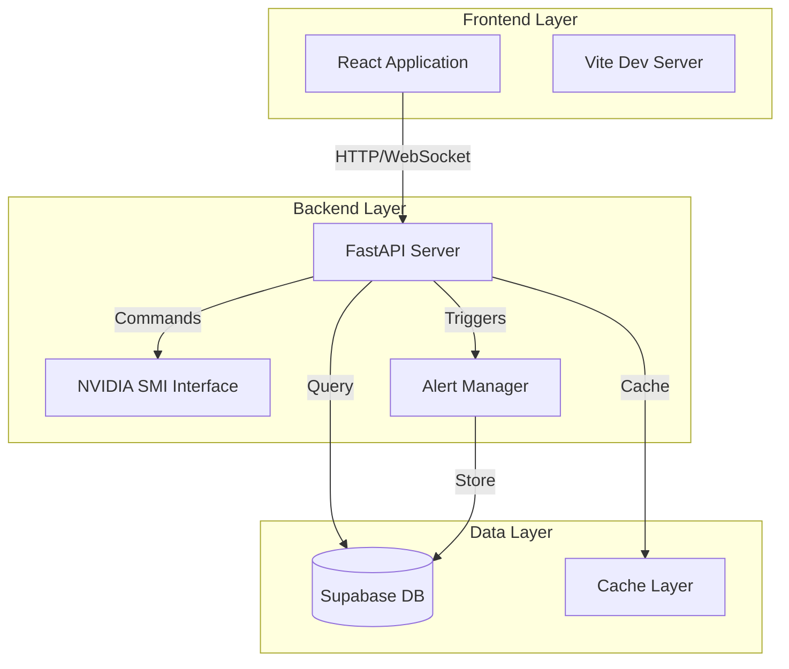
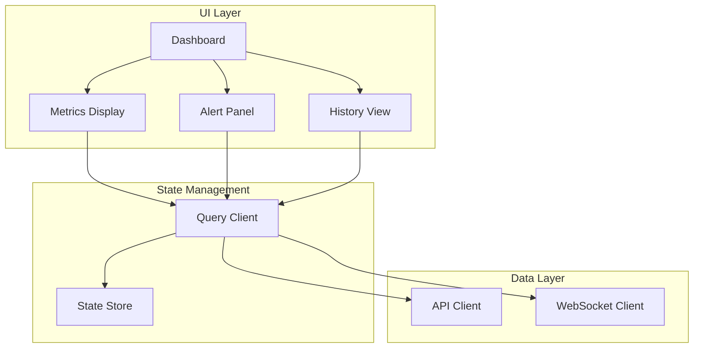
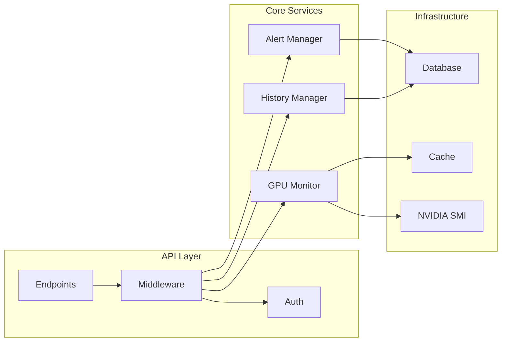
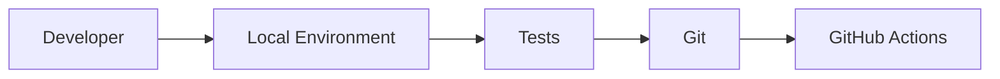
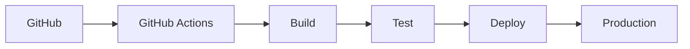
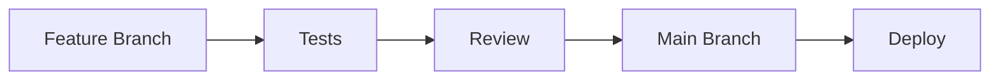

# GPU Sentinel Pro - System Architecture

## System Overview



## Component Architecture

### Frontend Components



### Backend Services



## Data Flow

### Real-time Metrics Flow
1. NVIDIA SMI polls GPU metrics (250ms intervals)
2. Backend processes and validates data
3. WebSocket pushes updates to frontend
4. React components re-render with new data
5. Metrics stored in time-series database

### Alert Flow
1. Backend evaluates metrics against thresholds
2. Alert triggered if threshold exceeded
3. Alert stored in database
4. WebSocket pushes alert to frontend
5. Alert notification displayed
6. External notifications sent (email/webhook)

## Technical Components

### Frontend Stack
- **Framework**: React 18+
- **Language**: TypeScript 5+
- **Build Tool**: Vite
- **State Management**: React Query
- **UI Components**: Custom components
- **Data Visualization**: Custom charts
- **WebSocket Client**: Native WebSocket

### Backend Stack
- **Framework**: FastAPI
- **Language**: Python 3.10+
- **ASGI Server**: Uvicorn
- **Task Queue**: Background tasks
- **Caching**: In-memory + Redis
- **Monitoring**: Custom metrics

### Database Schema

#### GPU Metrics Table
```sql
CREATE TABLE gpu_metrics (
    id BIGSERIAL PRIMARY KEY,
    timestamp TIMESTAMPTZ NOT NULL,
    gpu_id INTEGER NOT NULL,
    temperature FLOAT,
    memory_used BIGINT,
    memory_total BIGINT,
    gpu_utilization INTEGER,
    power_draw FLOAT,
    power_limit FLOAT,
    fan_speed INTEGER,
    metadata JSONB,
    created_at TIMESTAMPTZ DEFAULT NOW()
);

CREATE INDEX idx_gpu_metrics_timestamp 
    ON gpu_metrics (timestamp DESC);
CREATE INDEX idx_gpu_metrics_gpu_id 
    ON gpu_metrics (gpu_id);
```

#### Alerts Table
```sql
CREATE TABLE alerts (
    id BIGSERIAL PRIMARY KEY,
    timestamp TIMESTAMPTZ NOT NULL,
    gpu_id INTEGER NOT NULL,
    alert_type VARCHAR(50) NOT NULL,
    severity VARCHAR(20) NOT NULL,
    message TEXT NOT NULL,
    value FLOAT,
    threshold FLOAT,
    acknowledged BOOLEAN DEFAULT FALSE,
    acknowledged_at TIMESTAMPTZ,
    created_at TIMESTAMPTZ DEFAULT NOW()
);

CREATE INDEX idx_alerts_timestamp 
    ON alerts (timestamp DESC);
CREATE INDEX idx_alerts_gpu_id 
    ON alerts (gpu_id);
```

## Security Architecture

### Authentication Flow
1. Client requests access
2. Server validates credentials
3. JWT token issued
4. Token included in subsequent requests
5. Token refresh mechanism

### Authorization Levels
- **Admin**: Full system access
- **User**: View and acknowledge alerts
- **Reader**: View-only access
- **API**: Programmatic access

### Data Security
- Encryption at rest
- TLS for data in transit
- Secure WebSocket connections
- Rate limiting
- Input validation

## Deployment Architecture

### Development Environment


### Production Environment


## Performance Considerations

### Frontend Optimization
- Component memoization
- Virtual scrolling for large datasets
- Efficient re-rendering
- Asset optimization
- Code splitting

### Backend Optimization
- Connection pooling
- Query optimization
- Caching strategy
- Async operations
- Resource limits

### Database Optimization
- Partitioning strategy
- Index optimization
- Query performance
- Data retention
- Backup strategy

## Monitoring and Logging

### System Metrics
- API response times
- WebSocket performance
- Database query times
- Cache hit rates
- Error rates

### Application Logs
- Request/response logging
- Error tracking
- Performance metrics
- Security events
- System health

## Scalability Considerations

### Horizontal Scaling
- Stateless backend
- Load balancing
- Session management
- Cache distribution
- Database replication

### Vertical Scaling
- Resource optimization
- Memory management
- Connection pooling
- Query optimization
- Batch processing

## Future Architecture Considerations

### Planned Enhancements
- Kubernetes integration
- Cloud provider metrics
- ML-based predictions
- Advanced analytics
- Custom dashboards

### Technical Debt Management
- Code quality metrics
- Performance monitoring
- Security scanning
- Dependency updates
- Documentation updates

## Development Workflow

### Code Pipeline


### Quality Assurance
- Automated testing
- Code review process
- Performance testing
- Security scanning
- Documentation review