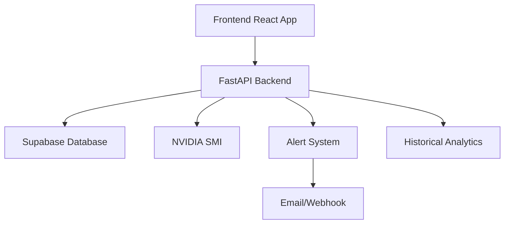

# GPU Sentinel Pro - Technical Specification

## System Architecture

### Component Overview


### Technology Stack
- **Frontend**
  - React 18+
  - TypeScript 5+
  - Vite
  - Real-time data visualization

- **Backend**
  - FastAPI
  - Python 3.10+
  - NVIDIA SMI integration
  - WebSocket support

- **Database**
  - Supabase (PostgreSQL)
  - Time-series optimization
  - Data partitioning

## Core Features Implementation

### 1. Real-Time Monitoring

#### Data Collection
```python
class GPUMetricsCollector:
    POLLING_INTERVAL = 250  # milliseconds
    
    async def collect_metrics(self):
        metrics = await nvidia_smi.get_metrics()
        return self.process_metrics(metrics)
```

#### Frontend Updates
```typescript
interface MetricsState {
  current: GPUMetrics;
  history: MetricsHistory;
  alerts: Alert[];
}

const useMetrics = () => {
  const [metrics, setMetrics] = useState<MetricsState>();
  // Polling implementation
};
```

### 2. Alert System

#### Alert Rules Engine
```python
class AlertRule:
    def __init__(self, metric: str, threshold: float, condition: Callable):
        self.metric = metric
        self.threshold = threshold
        self.condition = condition

    def evaluate(self, value: float) -> bool:
        return self.condition(value, self.threshold)
```

#### Notification System
```python
class NotificationManager:
    async def send_alert(self, alert: Alert):
        match alert.channel:
            case "email":
                await self.send_email(alert)
            case "webhook":
                await self.send_webhook(alert)
```

### 3. Historical Analysis

#### Data Storage Schema
```sql
CREATE TABLE gpu_metrics (
    id BIGSERIAL PRIMARY KEY,
    timestamp TIMESTAMPTZ NOT NULL,
    gpu_id INTEGER NOT NULL,
    metric_type VARCHAR(50) NOT NULL,
    value DOUBLE PRECISION NOT NULL,
    metadata JSONB,
    CONSTRAINT unique_metric 
        UNIQUE (timestamp, gpu_id, metric_type)
);

CREATE INDEX idx_metrics_timestamp 
    ON gpu_metrics (timestamp DESC);
```

#### Analytics Queries
```python
class MetricsAnalyzer:
    async def get_trends(
        self, 
        start_time: datetime,
        end_time: datetime,
        metric: str
    ) -> DataFrame:
        query = """
        SELECT 
            time_bucket('5 minutes', timestamp) AS interval,
            avg(value) as avg_value,
            max(value) as max_value,
            min(value) as min_value
        FROM gpu_metrics
        WHERE 
            timestamp BETWEEN $1 AND $2
            AND metric_type = $3
        GROUP BY interval
        ORDER BY interval;
        """
        return await self.db.fetch_all(query, start_time, end_time, metric)
```

## Performance Optimizations

### Backend Optimizations
```python
class MetricsCache:
    def __init__(self):
        self.cache = TTLCache(maxsize=1000, ttl=300)  # 5 minutes
        
    async def get_or_fetch(self, key: str) -> dict:
        if key in self.cache:
            return self.cache[key]
        value = await self.fetch_from_db(key)
        self.cache[key] = value
        return value
```

### Frontend Optimizations
```typescript
const useMetricsOptimized = () => {
  const queryClient = useQueryClient();
  
  return useQuery({
    queryKey: ['metrics'],
    queryFn: fetchMetrics,
    staleTime: 250,
    cacheTime: 1000 * 60 * 5,
    refetchInterval: 250
  });
};
```

## Error Handling

### Backend Error Handling
```python
class GPUError(Exception):
    def __init__(self, message: str, error_code: str):
        self.message = message
        self.error_code = error_code
        super().__init__(self.message)

async def handle_gpu_error(error: GPUError):
    log.error(f"GPU Error: {error.error_code} - {error.message}")
    return JSONResponse(
        status_code=500,
        content={
            "error": error.error_code,
            "message": error.message,
            "timestamp": datetime.utcnow().isoformat()
        }
    )
```

### Frontend Error Boundaries
```typescript
class MetricsErrorBoundary extends React.Component {
  state = { hasError: false, error: null };
  
  static getDerivedStateFromError(error: Error) {
    return { hasError: true, error };
  }
  
  render() {
    if (this.state.hasError) {
      return <ErrorDisplay error={this.state.error} />;
    }
    return this.props.children;
  }
}
```

## Security Measures

### API Authentication
```python
class SecurityConfig:
    JWT_ALGORITHM = "HS256"
    JWT_EXPIRE_MINUTES = 60
    
    @staticmethod
    def create_access_token(data: dict) -> str:
        expire = datetime.utcnow() + timedelta(minutes=SecurityConfig.JWT_EXPIRE_MINUTES)
        to_encode = data.copy()
        to_encode.update({"exp": expire})
        return jwt.encode(to_encode, settings.SECRET_KEY, algorithm=SecurityConfig.JWT_ALGORITHM)
```

### Data Validation
```python
class MetricsValidator:
    @staticmethod
    def validate_gpu_metrics(metrics: dict) -> bool:
        required_fields = {'temperature', 'memory_used', 'gpu_utilization'}
        return all(
            isinstance(metrics.get(field), (int, float))
            for field in required_fields
        )
```

## Deployment Configuration

### Docker Setup
```dockerfile
# Backend
FROM python:3.11-slim
WORKDIR /app
COPY requirements.txt .
RUN pip install -r requirements.txt
COPY . .
CMD ["uvicorn", "app.main:app", "--host", "0.0.0.0", "--port", "5500"]

# Frontend
FROM node:20-alpine
WORKDIR /app
COPY package*.json ./
RUN npm install
COPY . .
RUN npm run build
```

### Environment Configuration
```yaml
# Backend config
SUPABASE_URL: ${SUPABASE_URL}
SUPABASE_KEY: ${SUPABASE_KEY}
LOG_LEVEL: info
METRICS_RETENTION_DAYS: 30
ALERT_COOLDOWN_MINUTES: 5

# Frontend config
VITE_API_URL: ${API_URL}
VITE_WS_URL: ${WS_URL}
VITE_UPDATE_INTERVAL: 250
```

## Monitoring and Logging

### Application Logging
```python
class LogConfig:
    @staticmethod
    def setup_logging():
        logging.config.dictConfig({
            'version': 1,
            'disable_existing_loggers': False,
            'formatters': {
                'default': {
                    'format': '%(asctime)s - %(name)s - %(levelname)s - %(message)s'
                }
            },
            'handlers': {
                'console': {
                    'class': 'logging.StreamHandler',
                    'formatter': 'default'
                },
                'file': {
                    'class': 'logging.handlers.RotatingFileHandler',
                    'filename': 'gpu_service.log',
                    'maxBytes': 10485760,  # 10MB
                    'backupCount': 5,
                    'formatter': 'default'
                }
            },
            'root': {
                'level': 'INFO',
                'handlers': ['console', 'file']
            }
        })
```

## Testing Strategy

### Backend Tests
```python
class TestGPUMetrics:
    @pytest.fixture
    def metrics_collector(self):
        return GPUMetricsCollector()
    
    async def test_metrics_collection(self, metrics_collector):
        metrics = await metrics_collector.collect_metrics()
        assert 'temperature' in metrics
        assert isinstance(metrics['temperature'], (int, float))
```

### Frontend Tests
```typescript
describe('MetricsDisplay', () => {
  it('should update metrics every 250ms', async () => {
    const { result } = renderHook(() => useMetrics());
    await waitFor(() => {
      expect(result.current.data).toBeDefined();
    });
    expect(result.current.data.temperature).toBeGreaterThanOrEqual(0);
  });
});
```

## Performance Benchmarks

### Target Metrics
- API Response Time: < 100ms (95th percentile)
- Frontend Render Time: < 50ms
- Database Query Time: < 50ms
- Memory Usage: < 500MB
- CPU Usage: < 5% per core